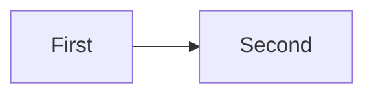
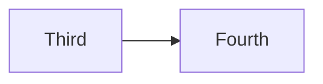

The first diagram is sound.

```mermaid
flowchart LR
    First --> Second
```

The second is not: its bracket is never closed.

```mermaid
flowchart TD
    A[Never closed --> B
```

The third is sound again.

```mermaid
flowchart LR
    Third --> Fourth
```

After the diagrams.
