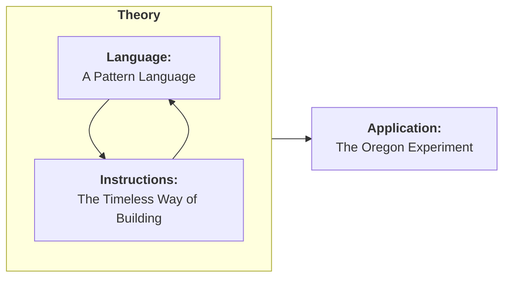
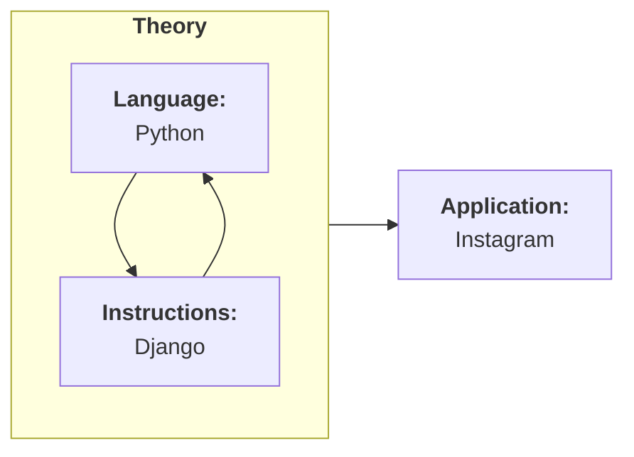

%% INTRO %%

Patterns are also prevalent in my main interest and occupation of [[tags/engineering/index|software engineering]]. Software is made up of lines of code in the same way that a building is made up of bricks and beams. They are the basic building materials, but random scatterings of code make as successful a piece of software as a random scattering of bricks would make a home. To make anything of use, you need to find helpful superstructures — abstract assemblies of those atomic pieces; we use the phrase [design patterns](https://refactoring.guru/design-patterns) to describe these.

Especially in object-oriented programming, many [creational](https://refactoring.guru/design-patterns/creational-patterns) and [structural](https://refactoring.guru/design-patterns/structural-patterns) patterns actually *do* borrow, directly from physical spaces[^1]. Factories, builders, bridges, facades — while they deal with data and information instead of physical structures, the abstract purposes match fairly well to their real-world analogs. Thinking in design patterns is, I think, what differentiates the role of software *development* — laying down the bricks of code — from software *architecture* — using patterns and theory to lay out the superstructures of the software.

## A Pattern Language — of another field

A few years ago, I stumbled on A Pattern Language while researching more about design patterns for software. What I stumbled into, though, was a bit of hubris: engineers didn't invent design patterns. Other fields have been using them for years.

A Pattern Language is, specifically, a series of patterns related to the physical development of structures and communities — homes, neighborhoods, towns, cities — using design patterns that can begin to describe the organic way we, human beings, have decided to organize ourselves over the course of the last few thousand years.

The text is broken into a few volumes:

- **Volume 1:** *The Timeless Way of Building*
- **Volume 2:** *A Pattern Language*
- **Volume 3:** *The Oregon Experiment*

Volumes 1 and 2 are closely related — *A Pattern Language* even states, in the first sentence, of the first paragraph, of the first *page*, that the two "are two halves of a single work." I would describe the system as:

This separation between the language and the instructions is not far off, conceptually, from how much software development is divvied up. We have the **language** — the way we express what we're creating; the **instructions** — how those expressions are mechanically laid out; and the **application** — the way the language and instructions interact to create the final product:

Once again, software engineering co-opting concepts that existed long before we did. *Classic!*

### Superstructures and substructures

Obviously, where *A Pattern Language* differs is that the patterns here, while varied in how abstract they are, never stray too far from the physical world. Some are very direct, neighboring literal construction practices, such as:

- **Pattern 191:** The Shape of Indoor Space;
- **Pattern 200:** Open Shelves; or
- **Pattern 251:** Different Chairs.

I will call these **sub**structure patterns — patterns dealing with details *smaller than* a single home, shop, or other structure.

Further ahead, the concepts begin to abstract away into patterns for **super**structures — full streets, towns, neighborhoods, or cities. They rise above the purely physical and describe less tactile details, such as:

1. **Pattern 12:** Communities of 7,000;
2. **Pattern 10:** Magic of the City; and
3. **Pattern 8:** Mosaic of Subcultures

The most abstract — **Pattern 1**, fittingly, is Independent Regions; a case that independent regions should be... well, independent.

![[public/assets/Pasted image 20260201161641.png]]

That is all to say: *A Pattern Language* seeks to cover a wide-ranging set of patterns to encapsulate all levels of structure that human beings could possibly dwell in. There are some patterns I agree with more than others. The amount of effort, however, that the authors have put into 253 separate rules seeking to cover the entirety of human habitat while being generalizable enough to cover many cultures? It's herculean.

## Earth: The World's Biggest Graph

Although my initial interest in *A Pattern Language* started with software design pattern research, reading the patterns has bubbled up a different interest: the representation of our world, and the many communities that make it up, as graphs.

When I say graphs, I don't mean a line graph on an X-Y plot — I mean it the most abstract sense of nodes as dots, and edges that connect them: the study of [graph theory](https://en.wikipedia.org/wiki/Graph_theory). This feels like an apt return to form, as the study of graph theory itself formed when Leonhard Euler (of the number *e*), in 1736, solved a puzzle about [seven bridges in the city of Königsberg](https://en.wikipedia.org/wiki/Seven_Bridges_of_K%C3%B6nigsberg):

![[public/assets/Pasted image 20260201163320.png]]
![[public/assets/Pasted image 20260201163331.png]]

Maps are simply graphs of the real world. In fact, whenever a device shows you a map, gives you directions, it's not *seeing* left turns and right turns, streets and buildings — it's seeing nodes on a graph, and the edges that connect them.

My hope with *A Pattern Language* is to learn more about the relationship *between* nodes on the graph — a language not just to better understand how our towns, cities, and communities are set up, but to more richly analyze the relationships between super- and sub-structures on the graphs we use to describe them.

## Understanding The Neighborhood

This ultimately lends itself to another project that I've been hoping to work on for a very long time — [[tags/projects/games/neighborhood/index|The Neighborhood]]. What form this project will take is a bit up-in-the-air, as it really depends on how well I can analyze graphs. The goal, though, is simple:

We have so much data about the world around us. We've learned that it's, all things considered, fairly straightforward to simply collect everything, always, all the time:

![[public/assets/Pasted image 20260201164026.png]]

However, you and I don't see our communities as nodes and edges. We see them as alive — they're the places we rest, where we work, the friends in our lives, our connection to others. These are all in the raw data, but their *meaning* is a superstructure. It's not the lines on the graph — it's somewhere hidden between them.

My hope is to understand and apply the language to create a system that can process the raw data and boil it down to something smaller, but representative. Given an area of data, The Neighborhood's first goal is to understand the abstract, conceptual relationships and generate something akin to the style of the old city-style playmats for kids, boiling down civic structure into an understandable toy.

![[public/assets/Pasted image 20260201164502.png]]

[^1]: This melts down a bit more when you get into [functional programming](https://en.wikipedia.org/wiki/Functional_programming). If I had to give a TL;DR: software exists in a space between pure information and the real world. Object-oriented programming takes the angle of going from physical concepts into information space, and functional programming takes the angle of going from pure path into the information space. Functional programming does *also* have design patterns, but they are far more derived from mathematical concepts than object-oriented programming's physical analogs.