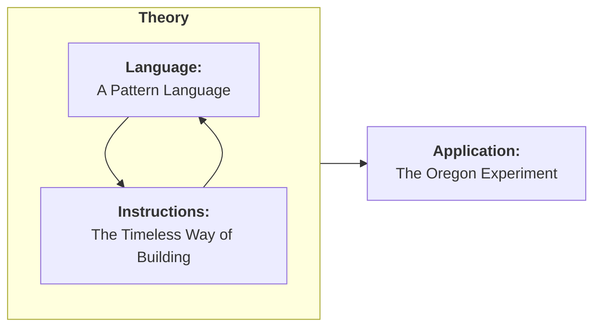
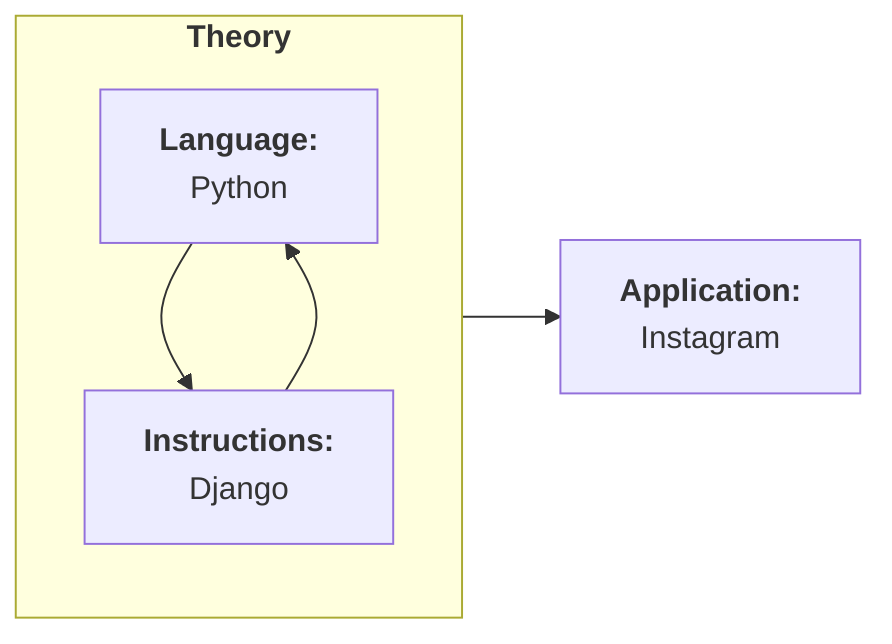

The world is too complicated a place to be understood, wholly, exactly how it is. With each passing day, it becomes *more* complicated. Not even a century ago, the general term "scientist" could be somebody's wholesale job title; a person who *in general, does science.* Now, we know enough about any given field that even among broad categories of science — biology, computing, chemistry, economics — nobody could ever hope to fully understand even a *subsection* of the world. Broad strokes, rules-of-thumb, and statements with many, *many* asterisks are required to even *begin* to understand the many forces that govern our lives.

These are *patterns*, and they're our greatest tool in comprehending the basics of the incomprehensible.

Patterns are prevalent in my main interest and occupation of [[tags/engineering/index|software engineering]]. Software is made up of lines of code in the same way that a building is made up of bricks and beams. They are the basic building materials, but random scatterings of code make as successful a piece of software as a random scattering of bricks would make a home. To make anything of use, you need to step back and see the bricks for what they build, or code for what process it defines; we use the phrase [design patterns](https://refactoring.guru/design-patterns) to describe the larger structures we build.

For a long time, I had assumed that design patterns were a term *coined* by software engineers, even if many patterns do borrow terminology from other fields. Especially in object-oriented programming, many [creational](https://refactoring.guru/design-patterns/creational-patterns) and [structural](https://refactoring.guru/design-patterns/structural-patterns) patterns actually *do* borrow, directly from physical spaces[^1]. Factories, builders, bridges, facades — while they deal with data and information instead of physical structures, the abstract purposes match fairly well to their real-world analogs. Thinking in design patterns is, I think, what differentiates the role of software *development* — laying down the bricks of code — from software *architecture* — using patterns and theory to lay out the superstructures of the software.

## *A Pattern Language* — of another field

A few years ago, I stumbled on *[A Pattern Language](https://arl.human.cornell.edu/linked%20docs/Alexander_A_Pattern_Language.pdf)* while researching more about design patterns for software. What I stumbled into, though, was a bit of hubris: engineers didn't invent design patterns. Other fields have been using them for years.

*A Pattern Language* is, specifically, a series of patterns related to the physical development of structures and communities — homes, neighborhoods, towns, cities — using design patterns that can begin to describe the organic way we, human beings, have decided to organize ourselves over the course of the last few thousand years.

The text is broken into a few volumes:

- **Volume 1:** *The Timeless Way of Building*
- **Volume 2:** *A Pattern Language*
- **Volume 3:** *The Oregon Experiment*

Volumes 1 and 2 are *very* closely related. *A Pattern Language* even states — in the first sentence, of the first paragraph, of the first *page* — that itself and *The Timeless Way of Building* "... are two halves of a single work." I would describe the system as:

This separation between the language and the instructions is not far off, conceptually, from how much software development is divvied up. We have the **language** — the way we express what we're creating; the **instructions** — how those expressions are mechanically laid out; and the **application** — the way the language and instructions interact to create the final product:

Once again, software engineering co-opting concepts that existed long before we did. *Classic!*

### Superstructures and substructures

Obviously, where *A Pattern Language* differs is that the patterns here, while varied in how abstract they are, never stray too far from the physical world. Some are very direct, neighboring literal construction practices, such as:

- **Pattern 191:** The Shape of Indoor Space;
- **Pattern 200:** Open Shelves; or
- **Pattern 251:** Different Chairs.

I will call these **sub**structure patterns — patterns dealing with details *smaller than* a single home, shop, or other structure.

Further ahead, the concepts begin to abstract away into patterns for **super**structures — full streets, towns, neighborhoods, or cities. They rise above the purely physical and describe less tactile details, such as:

1. **Pattern 12:** Communities of 7,000;
2. **Pattern 10:** Magic of the City; and
3. **Pattern 8:** Mosaic of Subcultures

The most abstract — **Pattern 1**, fittingly — is Independent Regions; a case that independent regions should be... well, independent.

![[assets/Pasted image 20260201161641.png]]

That is all to say: *A Pattern Language* seeks to cover a wide-ranging set of patterns to encapsulate all levels of structure that human beings could possibly dwell in. There are some patterns I agree with more than others. The amount of effort, however, that the authors have put into 253 separate rules seeking to cover the entirety of human habitat while being generalizable enough to cover many cultures? It's herculean.

### Earth: The World's Biggest Graph

Although my initial interest in *A Pattern Language* started with software design pattern research, reading the patterns has bubbled up a different interest: the representation of our world, and the many communities that make it up, as graphs.

When I say graphs, I don't mean a line graph on an X-Y plot — I mean it in the most abstract sense — dots that represent *things*, and lines that *connect* those things: the study of [graph theory](https://en.wikipedia.org/wiki/Graph_theory). This feels like an apt return to form, as the study of graph theory itself formed in 1736 when Leonhard Euler (of the number ***e***), solved a puzzle about [seven bridges in the city of Königsberg](https://en.wikipedia.org/wiki/Seven_Bridges_of_K%C3%B6nigsberg):

![[assets/Pasted image 20260201163320.png]]

![[assets/Pasted image 20260201163331.png]]

Maps are simply graphs of the real world. In fact, whenever a device shows you a map, gives you directions, it's not *seeing* left turns and right turns, streets and buildings — it's seeing nodes on a graph, and the edges that connect them.

My hope with *A Pattern Language* is to learn more about the relationship *between* nodes on the graph — a language not just to better understand how our towns, cities, and communities are set up, but to more richly analyze the relationships between super- and sub-structures on the graphs we use to describe them.

### Understanding The Neighborhood

This ultimately lends itself to another project that I've been hoping to work on for a very long time — [[tags/projects/games/neighborhood/index|The Neighborhood]]. What form this project will take is, to put it mildly, a bit up-in-the-air; it will really depend on how well I can analyze maps as graphs. The goal, though, is simple:

We have so much data about the world around us. We've learned that it's, all things considered, fairly straightforward to simply collect everything, always, all the time:

![[assets/Pasted image 20260201164026.png]]

However, you and I don't see our communities as nodes and edges. We see them as alive — they're the places we rest, where we work, the friends in our lives, our connection to others. The literal places and the ways they're connected are all in the raw data, but their *meaning* — the *semantics* of data, to each of us — is a superstructure. The deeper connections are not the lines on the graph — they're somewhere hidden between them.

My hope is to understand and apply the language to create a system that can process the raw data and boil it down to something smaller, but representative. Given an area of data, The Neighborhood's first goal is to understand the abstract, conceptual relationships and generate something akin to the style of the old city-style playmats for kids, boiling down civic structure into an understandable toy.

![[assets/Pasted image 20260201164502.png]]

I have many amorphous thoughts on what form of a game The Neighborhood will take — thoughts that I'll spare you from, until they take some more concrete, actionable and *playable* form — but I consider the graphical analysis of real map data to be at the core of the concept.

## How the `#annotations/pattern-language` project will work.

Unfortunately, I won't be able to truly annotate the work in the same way I made the public annotations for *[[content/annotations/college-admissions-and-the-stability-of-marriage|College Admissions and the Stability of Marriage]]* or *[[content/annotations/llm-starter|The LLMs Starter]]*. I lack, at the current time, a good way to automatically trim PDF or EPUB texts into preselected chapters. Additionally, the [online source from Cornell](https://arl.human.cornell.edu/linked%20docs/Alexander_A_Pattern_Language.pdf) is, unfortunately, missing quite a bit of the text (only 313 of the full 1169-page text —  a bit over 25%).

Nonetheless, I'll be annotating my physical copy of the book and moving those annotations, piecemeal, into this blog under the [[tags/writing/annotations/pattern-language/index|pattern-language]] tag. I've already pre-generated 255 notes, one for each pattern (as well as an intro and conclusion note). The reason for pre-generating them is simple: the patterns form a graph, themselves. Each pattern references other patterns. This is most clear in the first portions of each pattern entry. For example, the introduction to [[content/annotations/a-pattern-language/62-high-places|Pattern 62: High Places]]:

> [!QUOTE]
> ... according to [[content/annotations/a-pattern-language/21-four-story-limit|Four Story Limit (21)]], most roofs in the community are no higher than four stories, about 40 or 50 feet. However, it is very important that this height limit be punctuated, just occasionally, by higher building which have special functions. They can help the character of the [[content/annotations/a-pattern-language/61-small-public-squares|Small Public Squares (61)]] and [[content/annotations/a-pattern-language/66-holy-ground|Holy Ground (66)]]; they can give particular identity to their communities, provided that they do not occur more frequently than one in each [[content/annotations/a-pattern-language/12-community-of-7000|Community of 7,000 (12)]].

The amount of explicit links between patterns is practically *begging* to be graphed out like the other pages on this site. To better learn this information for understanding the graphs formed by maps of the world, I also want to understand the graph of these patterns' connections to one another.

### Process

As I complete annotations for patterns within *A Pattern Language*, I'll do two things:

1. I will update the date of the post to reflect the day I wrote the annotation; and
2. I will move the note from my private vault to my public one.

This is a very solid piece of work, and I don't anticipate that anything from the completed annotations would spoil any additional work on The Neighborhood. The book itself is fantastic — if any note inspires anybody to pick up a paper copy of the text, it'd have been well worth my time.

### Pacing

With 253 patterns to annotate, this will doubtless be a long-running project (the scope has already decimated the organization of my site graph). Even at a *very generous* estimated pace pace averaging one pattern a day, that'd make for an completion date eight months in the future — October of this year. While I have every intention, as of writing this, to read back through the text and have at least *some* annotation for each section (if only just to complete the link connections between a pattern and its neighbors), I will need to triage the pacing a bit.

Above, I define the terms *substructure* to mean "structures smaller than a whole building" and *superstructure* to mean "structures larger than a whole building". I've created two subtags — [[tags/writing/annotations/pattern-language/sub/index|pattern-language/sub]] and [[tags/writing/annotations/pattern-language/super/index|pattern-language/super]] — to sort patterns into these two categories. I'll be prioritizing the `#super` patterns first, as they relate more to what I'd like to get out of this reading. The book does a preliminary grouping into Towns and Buildings, that I've temporarily co-opted as the current super- and sub-boundaries:

- **Towns:** [[content/annotations/a-pattern-language/01-independent-regions|Independent Regions (01)]] to [[content/annotations/a-pattern-language/94-sleeping-in-public|Sleeping in Public (94)]]
- **Buildings:** [[content/annotations/a-pattern-language/95-building-complex|Building Complexes (95)]] to [[content/annotations/a-pattern-language/253-things-from-your-life|Things From Your Life (253)]]

However, I can already see that these categories will be fluid, with some current superstructure patterns being better suited to substructures (e.g. [[content/annotations/a-pattern-language/92-bus-stop|Bus Stops (92)]]) or some current substructures being better suited as superstructures (e.g. [[content/annotations/a-pattern-language/120-paths-and-goals|Paths and Goals (120)]]). Those re-categorizations will track here with time, but don't expect my distribution or classification to be as clean-cut as the book itself makes them out to be.

Finally: the text itself groups patterns into broader categories — for example, a transit category composed of the rules between [[content/annotations/a-pattern-language/49-looped-local-roads|Looped Local Roads (49)]] and [[content/annotations/a-pattern-language/57-children-in-the-city|Children in the City (57)]]. I may do larger composite notes for these groups, especially as they relate to the graph introspection goals of The Neighborhood.

## Conclusion

This will certainly be the largest notes collection on this site thus far. *A Pattern Language* is certainly a worthy candidate of it. If you are interested in urban design, civil engineering, or public policy, I would highly recommend purchasing a copy of the text yourself and giving it a read. Its authors — Christopher Alexander, Sara Ishikawa, Murray Silverstein, with Max Jacobson, Ingrid Fiksdahl-King, and Shlomo Angel — deserve credit for the work they put into researching, organizing, and publishing these thoughts.

[^1]: This melts down a bit more when you get into [functional programming](https://en.wikipedia.org/wiki/Functional_programming). If I had to give a TL;DR: software exists in a space between pure information and the real world. Object-oriented programming takes the angle of going from physical concepts into information space, and functional programming takes the angle of going from pure path into the information space. Functional programming does *also* have design patterns, but they are far more derived from mathematical concepts than object-oriented programming's physical analogs.
