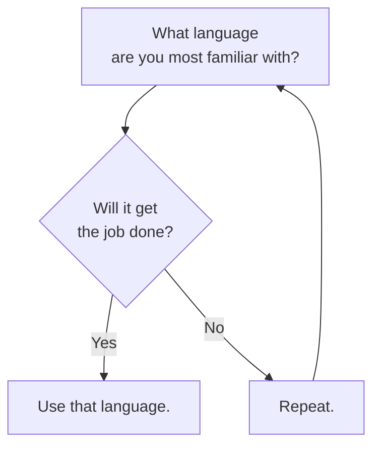

I'm certainly not a person who has [[/content/notes/strong-and-weak-opinions|strong opinions]] about programming languages. My personal and professional decision graph around language choice is:

That said, I do break out languages according to the task:

| The Job                                                            | The Languages                                                                                                                                                                                         |
| ------------------------------------------------------------------ | ----------------------------------------------------------------------------------------------------------------------------------------------------------------------------------------------------- |
| **[[/tags/projects\|Application development]]**              | [[/tags/engineering/languages/csharp\|.NET]] and [[/tags/engineering/languages/typescript\|TypeScript]] (stack used for my [[/tags/projects/dayjob\| day job]])                     |
| **[[/tags/engineering/data\|Data science and engineering]]** | [[/tags/engineering/languages/python\|Python]] and/or [[/tags/engineering/languages/csharp\|.NET]] (via [[/tags/projects/flowthru\|Flowthru]])                                      |
| **[[/tags/projects/games\|Game development]]**               | [[/tags/engineering/languages/typescript\|TypeScript]], [[/tags/engineering/languages/csharp\|.NET]], and [[/tags/engineering/languages/lua\|Lua]]                                  |
| **[[/tags/engineering/frontend\|Web development]]**          | [[/tags/engineering/languages/typescript\|TypeScript]] and/or [[/tags/engineering/languages/csharp\|.NET]] (via [Blazor](https://dotnet.microsoft.com/en-us/apps/aspnet/web-apps/blazor)) |

