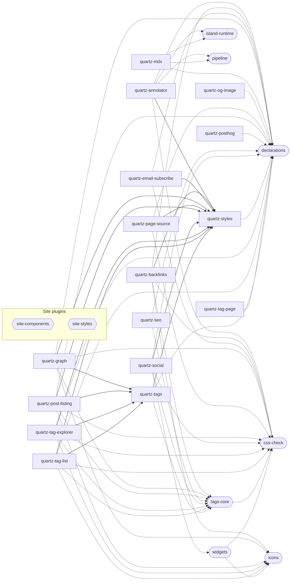

`#projects/site/plugins` collects the `cgc-*` plugins this site is built with. Each is a [Quartz 5](https://quartz.jzhao.xyz/) plugin written for other sites to install too, and each page below is that plugin's README, published as a note. The rest of the site's own work is under [[/tags/projects/site/index|#site]].

Most of them share things with each other. The diagram shows how every package in the site's `quartz-v5/` folder depends on the others. Each plugin is a box, each library a rounded box, and each site plugin a hexagon:

- a **solid arrow** runs from a plugin to a plugin it declares as a dependency: an engine, such as `cgc-tags`, whose published data it reads, or `cgc-styles`, which gives its styles their place in the cascade;
- a **dotted arrow** runs from a package to one of the libraries it builds with, such as `tags-core`. A library is a plain npm package that a plugin inlines or runs when it builds, so it is never a plugin of its own;
- the **site plugins** carry this site's own look and layout, and are not meant for other sites.

Click a plugin to read its note.

%% plugin-dag: start. Generated from the packages' manifests by `pnpm nx run site-v5:plugin-dag`: don't edit by hand. %%

%% plugin-dag: end %%
